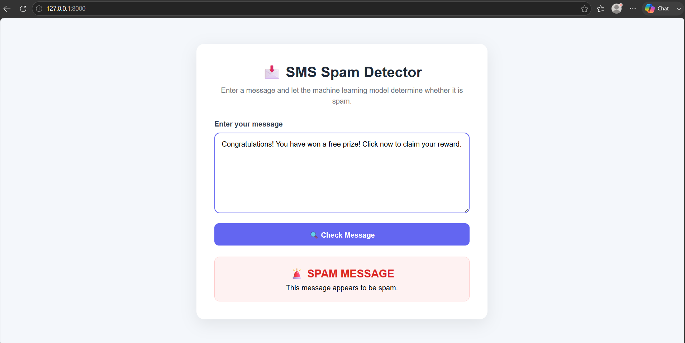
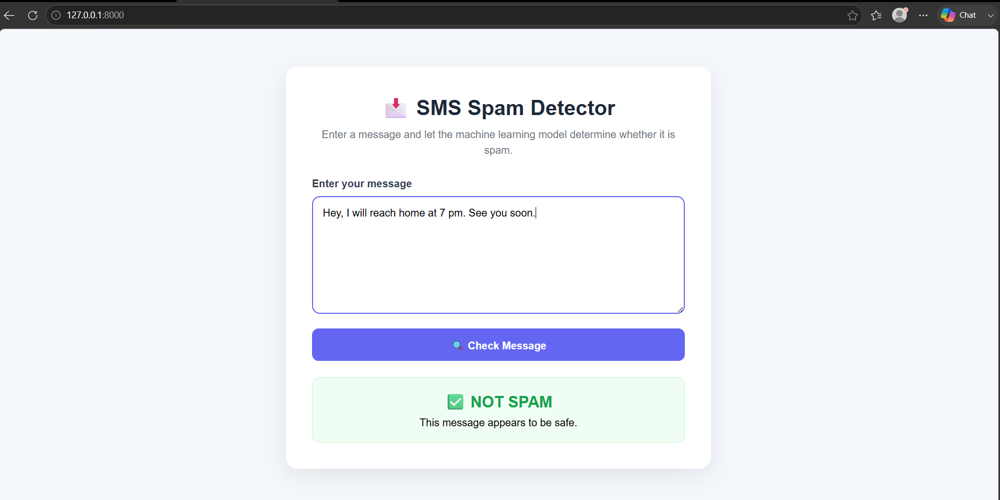

# 📩 SMS Spam Classifier

A simple **Machine Learning + Django web application** that classifies
an SMS/text message as either **SPAM** or **NOT SPAM**.

This project was built as a practical machine learning deployment
project: the trained ML model is connected to a Django frontend where a
user can enter a message and receive a prediction.

------------------------------------------------------------------------

## 🚀 Project Overview

The application takes a text message from the user and sends it through
the following pipeline:

``` text
User enters SMS
       ↓
Django Web Application
       ↓
Text Preprocessing (NLTK)
       ↓
TF-IDF Vectorizer
       ↓
Trained ML Model
       ↓
Prediction
       ↓
SPAM / NOT SPAM
```

The trained model and vectorizer are stored using Python pickle files:

-   `model.pkl` --- trained classification model
-   `vectorize.pkl` --- trained TF-IDF vectorizer

------------------------------------------------------------------------

## ✨ Features

-   📝 Simple text input interface
-   🤖 Machine learning based spam classification
-   🌐 Django web application
-   🧹 NLTK-based text preprocessing
-   🔤 TF-IDF text vectorization
-   🚨 Clear SPAM result display
-   ✅ Clear NOT SPAM result display
-   📱 Responsive and clean UI
-   🔒 Django CSRF protection on the form

------------------------------------------------------------------------

## 🛠️ Technologies Used

  Technology     Purpose
  -------------- ---------------------------------------------
  Python         Main programming language
  Scikit-learn   Machine learning model
  NLTK           Text preprocessing
  Pandas         Data processing
  NumPy          Numerical operations
  Django         Web application/backend
  HTML           Frontend structure
  CSS            Frontend styling
  Pickle         Saving/loading trained model and vectorizer

------------------------------------------------------------------------

## 🧠 Machine Learning

The model was trained on approximately **5,000 SMS messages**.

The general ML workflow is:

1.  Load the SMS dataset.
2.  Clean and preprocess the text.
3.  Remove unnecessary text elements.
4.  Apply NLTK-based preprocessing.
5.  Convert text into numerical features using TF-IDF.
6.  Train the classification model.
7.  Save the trained model using pickle.
8.  Save the fitted vectorizer using pickle.
9.  Load both files inside the Django application.
10. Use the model to predict new messages entered by the user.

### Prediction labels

``` text
0 → NOT SPAM
1 → SPAM
```

------------------------------------------------------------------------

## 🌐 Django Web Application

The Django application contains a simple interface where the user can:

1.  Enter an SMS/message.
2.  Click **Check Message**.
3.  The Django backend preprocesses the message.
4.  The vectorizer transforms the message.
5.  The trained model makes the prediction.
6.  The result is displayed on the webpage.

### Example

``` text
Input:
"Congratulations! You have won a free prize! Click now to claim your reward."

Output:
🚨 SPAM MESSAGE
```

------------------------------------------------------------------------

## 📸 Application Screenshots

### 🚨 Spam Message Detection

The application correctly identifies a typical promotional spam message.



### ✅ Normal Message Detection

The application identifies a normal conversational message as not spam.



------------------------------------------------------------------------

## 📁 Project Structure

A simplified project structure looks like this:

``` text
SMS-Spam-Classifier/
│
├── Notebook/
│   └── Spam_detection.ipynb
│
└── Web Application/
    │
    ├── manage.py
    │
    ├── model.pkl
    ├── vectorize.pkl
    │
    ├── detector/
    │   ├── migrations/
    │   ├── static/
    │   │   └── detector/
    │   │       └── style.css
    │   │
    │   ├── templates/
    │   │   └── detector/
    │   │       └── index.html
    │   │
    │   ├── admin.py
    │   ├── apps.py
    │   ├── models.py
    │   ├── tests.py
    │   └── views.py
    │
    └── <django-project-folder>/
        ├── settings.py
        ├── urls.py
        └── ...
```

------------------------------------------------------------------------

## ⚙️ How to Run the Project

### 1. Clone/download the project

Open the project directory in a terminal.

### 2. Install dependencies

``` bash
pip install django pandas numpy scikit-learn nltk
```

If your project uses additional packages, install those as well.

### 3. Start the Django development server

Go to the folder containing `manage.py`:

``` bash
cd "Web Application"
```

Then run:

``` bash
python manage.py runserver
```

### 4. Open the application

Open:

``` text
http://127.0.0.1:8000/
```

You can now enter an SMS and check its classification.

------------------------------------------------------------------------

## 🔄 Model Integration

The Django application loads the saved model and vectorizer rather than
training the model every time a user submits a message.

Conceptually:

``` python
model = pickle.load(...)
vectorizer = pickle.load(...)

message = preprocess(message)
message_vector = vectorizer.transform([message])

prediction = model.predict(message_vector)
```

This keeps the web application lightweight and separates **model
training** from **model inference**.

------------------------------------------------------------------------

## ⚠️ Current Limitations

The current model was trained on approximately **5,000 messages**, so it
does not perfectly generalize to every possible spam message.

For example, a message can be obviously suspicious to a human but still
be classified as NOT SPAM if its wording is different from the patterns
present in the training data.

This is a normal machine-learning limitation and can result in:

-   False positives
-   False negatives
-   Poor performance on unfamiliar wording
-   Reduced performance when the input vocabulary differs significantly
    from the training dataset

The current system should therefore be treated as a **machine-learning
demonstration/project**, not as a security-grade spam detection system.

------------------------------------------------------------------------

## 🔮 Future Improvements

Possible improvements include:

-   📚 Train on a larger and more diverse dataset
-   ⚖️ Handle class imbalance
-   🔧 Tune TF-IDF parameters
-   🧪 Compare multiple ML algorithms
-   📊 Add confusion matrix and evaluation metrics
-   🎯 Improve recall for spam messages
-   🧠 Experiment with word and character n-grams
-   🔤 Compare stemming with lemmatization
-   ⚡ Add AJAX/JavaScript for prediction without page reload
-   📈 Add prediction confidence/probability where supported
-   🚀 Deploy the Django application online

------------------------------------------------------------------------

## 🎯 Learning Outcome

This project demonstrates the complete journey from a machine learning
model to a working web application:

``` text
Dataset
   ↓
Data Cleaning
   ↓
Text Preprocessing
   ↓
Feature Engineering
   ↓
Model Training
   ↓
Model Evaluation
   ↓
Model Serialization
   ↓
Django Integration
   ↓
Web Interface
   ↓
Real-time Prediction
```

It helped demonstrate how a trained machine learning model can be
integrated into a practical application instead of being used only
inside a Jupyter Notebook.

------------------------------------------------------------------------

## 👨‍💻 Author

**Harsh Gupta**

Machine Learning / Django Project

------------------------------------------------------------------------

## ⭐ If You Found This Project Useful

Feel free to explore, improve, and experiment with the model and web
application.
